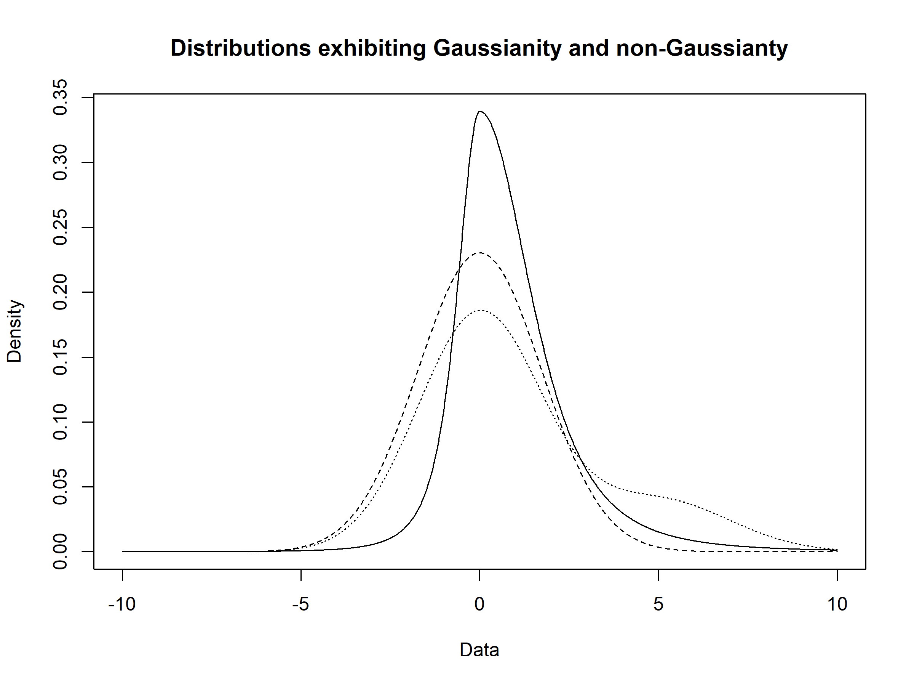

<!--
editPost:
    URL: "https://github.com/pmichaillat/hugo-website"
    Text: "Journal of Oleic Science"
-->
---

##### Download

+ [Paper](https://arxiv.org/abs/2510.23831)
<!-- + [Online appendix](appendix1.pdf) -->
+ [R package (TDVS)](https://github.com/Jiasong-Duan/TDVS)

---

##### Abstract

This project proposed a Bayesian variable selection method in the framework of modal regression for heavy-tailed and skewed responses. A test statistic is constructed to exploit the shape of the model error distribution to effectively separate informative covariates from unimportant ones. The computational cost is controlled by employing an efficient expectation-maximization algorithm for parameter estimation.  

---

##### Figure 1: Examples of distributions exhibiting light tails and symmetry, heavy tails and asymmetry, and heavy tails with skewness.



---

##### Citation

Duan, J., Zhang, H., & Huang, X. (2025). Testing-driven Variable Selection in Bayesian Modal Regression. arXiv preprint arXiv:2510.23831.

```BibTeX
@article{duan2025testing,
  title={Testing-driven Variable Selection in Bayesian Modal Regression},
  author={Duan, Jiasong and Zhang, Hongmei and Huang, Xianzheng},
  journal={arXiv preprint arXiv:2510.23831},
  year={2025}
}
```

---

<!-- ##### Related material

+ [Presentation slides](presentation1.pdf)
+ [Summary of the paper](https://www.penguinrandomhouse.com/books/110403/unusual-uses-for-olive-oil-by-alexander-mccall-smith/) -->
