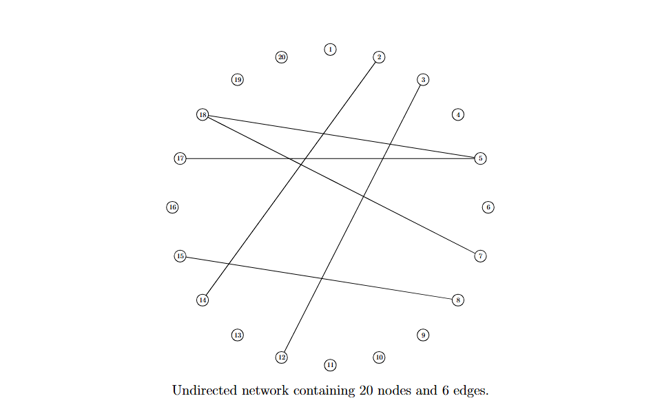

<!--
editPost:
    URL: "https://github.com/pmichaillat/hugo-website"
    Text: "Journal of Oleic Science"
-->


<!--##### Download

+ [Paper](https://arxiv.org/abs/2510.23831)
+ [Online appendix](appendix1.pdf) 
+ [R package](https://github.com/Jiasong-Duan/TDVS)
-->
---

##### Abstract

In this study, we propose a novel method for inferring undirected networks in parametric models, specifically designed for non-Gaussian data. Our approach assumes a flexible distribution family for each variable that accommodates heavy tails and skewness, which are two common data features leading to deviations from normality. This approach enables the study of interactions among non-Gaussian variables in a complex system, such as the interconnections of regulatory relationships among genes.

---

##### Figure 2: Example of an undirected network that contains 20 nodes and 6 edges.



---

<!--##### Citation

Duan, J., Zhang, H., & Huang, X. (2025). Testing-driven Variable Selection in Bayesian Modal Regression. arXiv preprint arXiv:2510.23831.

```BibTeX
@article{duan2025testing,
  title={Testing-driven Variable Selection in Bayesian Modal Regression},
  author={Duan, Jiasong and Zhang, Hongmei and Huang, Xianzheng},
  journal={arXiv preprint arXiv:2510.23831},
  year={2025}
}
```

---

##### Related material

+ [Presentation slides](presentation1.pdf)
+ [Summary of the paper](https://www.penguinrandomhouse.com/books/110403/unusual-uses-for-olive-oil-by-alexander-mccall-smith/) -->
