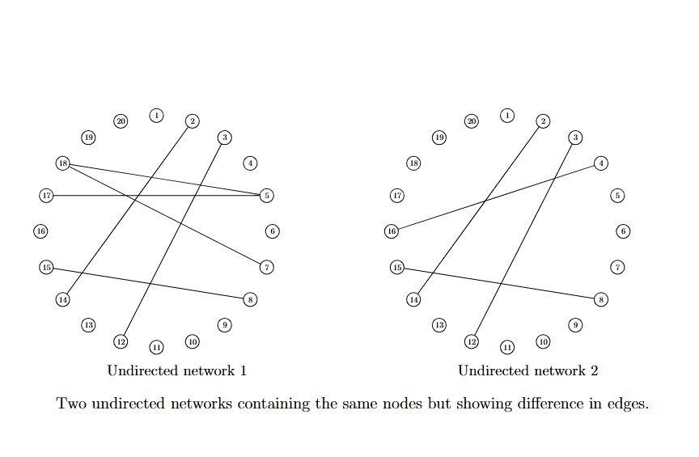

<!--
editPost:
    URL: "https://github.com/pmichaillat/hugo-website"
    Text: "Journal of Oleic Science"
-->


<!--##### Download

+ [Paper](https://arxiv.org/abs/2510.23831)
+ [Online appendix](appendix1.pdf) 
+ [R package](https://github.com/Jiasong-Duan/TDVS)
-->
---

##### Abstract

In this project, the problem is to characterize differences between two undirected networks in a way that is robust to non-Gaussian data. The proposed method has broad applications, for instance, in detecting differences between gene networks under different health conditions.

---

##### Figure 2: Example of two undirected networks that contain the same nodes but exhibit differences in edges.



---

<!--##### Citation

Duan, J., Zhang, H., & Huang, X. (2025). Testing-driven Variable Selection in Bayesian Modal Regression. arXiv preprint arXiv:2510.23831.

```BibTeX
@article{duan2025testing,
  title={Testing-driven Variable Selection in Bayesian Modal Regression},
  author={Duan, Jiasong and Zhang, Hongmei and Huang, Xianzheng},
  journal={arXiv preprint arXiv:2510.23831},
  year={2025}
}
```

---

##### Related material

+ [Presentation slides](presentation1.pdf)
+ [Summary of the paper](https://www.penguinrandomhouse.com/books/110403/unusual-uses-for-olive-oil-by-alexander-mccall-smith/) -->
